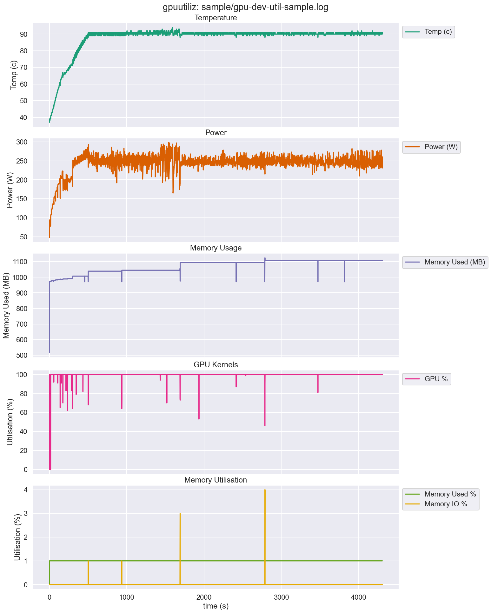

# gpuutilz plotting script

Quick and dirty seaborn-based plotting for [willfurnass/gpuutiliz](https://github.com/willfurnass/gpuutiliz) generated gpu data

## Dependencies

python dependencies are listed in `requirements.txt`

```bash
python3 -m venv .venv
source .venv/bin/activate
python3 -m pip install -r requirements.txt
```

## Usage

See `--help` for full usage:

```bash
./plot-gpuutiliz.py --help
```

Sample figure generated via:

```bash
./plot-gpuutiliz.py -i sample/gpu-dev-util-sample.log -o sample/gpu-dev-util-sample.png
```


